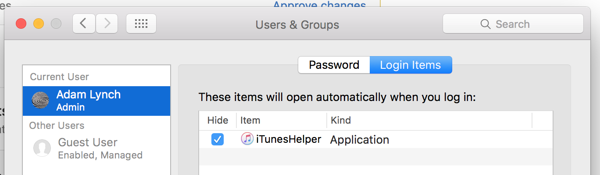

node-auto-launch
==============

[![NPM version][npm-image]][npm-url] [![Build Status][travis-image]][travis-url] [![Windows Build Status][appveyor-image]][appveyor-url] [![Dependency Status][depstat-image]][depstat-url]

---

Auto-launch your app on login.

- :star: Launch any application or executable at startup / login / boot.
- :star: Supports Linux, Mac (via AppleScript or Launch Agent), and Windows.
- :star: Supports [NW.js](http://nwjs.io/) and [Electron](http://electron.atom.io/) (with or without Squirrel; i.e. even if you're using Electron's built-in [`autoUpdater`](http://electron.atom.io/docs/api/auto-updater/) API).
- :star: Auto-detects your app path for NW.js and Electron apps.
- :star: Supports NW.js and Electron apps in Windows Store (with some caveats). 
- :disappointed: Not Mac App Store friendly. See [Make this Mac App Store compatible](https://github.com/Teamwork/node-auto-launch/issues/43) for more information.


## Usage

```javascript
var AutoLaunch = require('auto-launch');

var minecraftAutoLauncher = new AutoLaunch({
	name: 'Minecraft',
	path: '/Applications/Minecraft.app',
});

minecraftAutoLauncher.enable();

//minecraftAutoLauncher.disable();


minecraftAutoLauncher.isEnabled()
.then(function(isEnabled){
	if(isEnabled){
	    return;
	}
	minecraftAutoLauncher.enable();
})
.catch(function(err){
    // handle error
});
```

## Installation

`npm install --save auto-launch`


## API

### `new AutoLaunch(options)`

**`options`** - Object

**`options.name`** - String

The name of your app.

**`options.path`** - String (optional for NW.js and Electron apps)

The absolute path to your app.

For NW.js and Electron apps, you don't have to specify the path. We guess based on `process.execPath`.

**`options.isHidden`** - (Optional) Boolean

If `true`, we instruct the operating system to launch your app in hidden mode when launching at login. Defaults to `false`.

**`options.mac`** (Optional) object

For Mac-only options.

**`options.mac.useLaunchAgent`** (optional) Boolean.

By default, we use AppleScript to add a Login Item. If this is `true`, we use a Launch Agent to auto-launch your app. Defaults to `false`. For more information, see [How does it work? (mac)](#mac) below.


### `.enable`

Sets your app to auto-launch at startup. Returns a Promise.


### `.disable`

Disables your app from auto-launching at startup. Returns a Promise.


### `.isEnabled()`

Returns a Promise which resolves to a Boolean; `true` if your app is set to launch on startup.


## How does it work?

### Linux

A [Desktop Entry](https://specifications.freedesktop.org/desktop-entry-spec/desktop-entry-spec-latest.html) is created; i.e. a `.desktop` file is created in `~/.config/autostart/`.

Note: if auto-launch is enabled and then your app is removed, this desktop entry file would be left behind on the user's machine.


### Mac

#### AppleScript (default)

We execute an AppleScript command to instruct `System Events` to add or remove a Login Item for your app. There are no files involved. To see your Login Items, you can go to *System Preferences*, *Users & Groups*, then *Login Items*. End users can add or disable items (including your app) here also, but most typical users aren't aware of it.



Note: This is not Mac App Store friendly; if you use it in your app, it will be rejected by the Mac App Store. We're only 99% sure on this as we haven't actually tried ourselves. See [Make this Mac App Store compatible](https://github.com/Teamwork/node-auto-launch/issues/43) for more information.


#### Launch Agent

This is a file-based method like Linux's Desktop Entry method. We add a `.plist` file in the user's `Library/LaunchAgents` directory to create a [Launch Agent](https://developer.apple.com/library/content/documentation/MacOSX/Conceptual/BPSystemStartup/Chapters/CreatingLaunchdJobs.html) for your app.

**Pros**

- Launch Agents are intended for daemons / something without UI, which might be applicable depending on your app.
- We *think* this method *seems* to be faster, as in to enable or disable auto-launching (there is no difference in the amount of time it takes your app to launch). Although, that's not really a concern.
- You might not trust AppleScript.

**Cons**

- Your app will not appear in the user's Login Items. Therefore the user can only toggle auto-launching inside your app, if you provide them with a setting of course (which you should!). This is not a huge deal as most users are not aware of Login Items preferences, but it would be ideal if your app appeared there.
- If the user was to remove your app, the file would be left behind on the user's machine.

If you find that the AppleScript method doesn't work for you and this method does, please let us know by [creating an issue](https://github.com/Teamwork/node-auto-launch/issues/new).

Note: This is not Mac App Store friendly; if you use it in your app, it will be rejected by the Mac App Store as this reaches outside of the app sandbox. See [Make this Mac App Store compatible](https://github.com/Teamwork/node-auto-launch/issues/43) for more information.


### Windows

We add a registry entry under `\HKEY_CURRENT_USER\Software\Microsoft\Windows\CurrentVersion\Run`.

Note: If the user was to remove your app, this would be left in the registry, but that's not such a big deal. You can probably configure your uninstaller to unset it.


#### Squirrel.Windows

If you're using [Squirrel.Windows](https://github.com/Squirrel/Squirrel.Windows), i.e. what's underneath Electron's built-in [`autoUpdater`](http://electron.atom.io/docs/api/auto-updater/) API on Windows, we add a registry entry for your app's `Update.exe` instead of your actual application. This is due to how Squirrel.Windows works under the hood. What if we didn't? Well, if the user started / restarted their machine after updating your app, it would launch the old version by mistake.

#### Windows App Store apps

If you have your Electron-based app in the Windows Store and would like to include auto launch functionality, simply linking to the executable path will not work. The Appx packages required for Electron are sandboxed and the install location can only be accessed by the system itself. 

There is a way to bypass that - it will require you to know the developer ID, app ID and package name of your app. Then, instead of using the exec path, you will need to set the path in `AutoLaunch()` config to: `explorer.exe shell:AppsFolder\DEV_ID.APP_ID!PACKAGE_NAME`. You can find your apps details by following [this article](http://winaero.com/blog/exclusive-how-to-start-a-modern-app-from-desktop-without-going-to-the-metro-start-screen/). Note that you might need to compile and submit your app to the store first to obtain these details.  


# Would you like to contribute?

We're always open to your help and feedback. See our [CONTRIBUTING.md](CONTRIBUTING.md).


[npm-url]: https://npmjs.org/package/auto-launch
[npm-image]: http://img.shields.io/npm/v/auto-launch.svg?style=flat

[appveyor-url]: https://ci.appveyor.com/project/adam-lynch/node-auto-launch/branch/master
[appveyor-image]: https://ci.appveyor.com/api/projects/status/0sraxp65vrj2axc3/branch/master?svg=true

[travis-url]: http://travis-ci.org/Teamwork/node-auto-launch
[travis-image]: http://img.shields.io/travis/Teamwork/node-auto-launch.svg?style=flat

[depstat-url]: https://david-dm.org/teamwork/node-auto-launch
[depstat-image]: https://david-dm.org/teamwork/node-auto-launch.svg?style=flat
